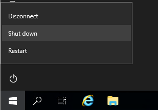
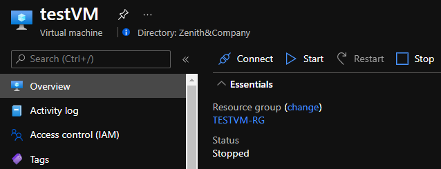

####

Azure에서 VM을 종료하는 방법은 여러가지가 있지만, 여기에서는 VM 내에서 VM을 종료하는 방법에 대해 다룬다. 

최신 PowerShell은 Multi-Platform을 지원하므로 Windows 뿐 아니라 Linux, Mac을 가리지 않고 잘 실행된다. 
아래 스크립트는 Azure 내 Windows, Linux에서 실행가능하다. (Azure에서는 Mac VM을 지원하지 않는다.)

## Deallocated = Not charged
Azure에서는 VM의 상태가 Stopped(Deallocated)가 되어야만 과금되지 않는다.



VM 내부에서 종료시 Azure에서는 Stopped로 표시되며, 이 상태에서는 과금이 된다.

즉, Deallocated로 표시되지 않을 때 모두 과금된다고 생각하면 된다.



## **사용자가 VM 내부에서 Deallocate 할 수 있는 방법이 없을까?**

> Answer - PowerShell : Stop-AzVM

여기 있다. 바로, PowerShell AzModule에 포함된 `Stop-AzVM` 명령어로 VM을 종료하는 스크립트를 실행하여, 종료 시킬수 있다.<br><br>

### PowerShell / AzModule 설치
먼저 작업할 VM 내에 PowerShell 최신 버전과 AzModule을 설치하자.

아래 링크에 들어가면 좌측메뉴에 Windows 외에 Linux, MacOS 에서 설치하는 방법에 대해서도 나와있다.

[https://docs.microsoft.com/ko-kr/powershell/scripting/install/installing-powershell-core-on-windows](https://docs.microsoft.com/ko-kr/powershell/scripting/install/installing-powershell-core-on-windows)

[https://docs.microsoft.com/ko-kr/powershell/azure/install-az-ps](https://docs.microsoft.com/ko-kr/powershell/azure/install-az-ps)


### Azure AD App (Service Principal) 생성
PowerShell로 Azure 명령어를 실행하기 위해서는 Azure 로그인이 필요한데, 스크립트 실행시 Azure Portal ID/PW를 매번 입력하기는 번거로운 일이다. 
이럴 땐 Azure AD App(Service Principal)을 생성하여 스크립트에 미리 심어두자.

아래 명령어는 Azure CLI 이며, 한줄로 Azure AD App을 만들어 주고 권한 부여를 해 준다.

```powershell
az ad sp create-for-rbac --role="Contributor" --scopes="subscriptions/your-subscription-id" --name="your.app"
```

Azure CLI가 좀 더 편리하지만, 여기서는 PowerShell 만을 이용하여 생성해 볼 것이다.

subscription이 하나만 존재한다면 -Scope 뒤쪽을 제외해도 권한이 부여된다. 여러개라면 subscription id를 확인하여 입력해 준다.

cmd나 linux shell에서 pwsh를 입력한다.

아래를 실행하여 로그인하고 SP를 생성한다.

```powershell
Connect-AzAccount

$sp = New-AzADServicePrincipal -DisplayName towhereim.app -Scope "/subscriptions/75d0****-baee-****-a42a-b01c8b1e4d5e"
$BSTR = [System.Runtime.InteropServices.Marshal]::SecureStringToBSTR($sp.Secret)
$UnsecureSecret = [System.Runtime.InteropServices.Marshal]::PtrToStringAuto($BSTR)

$sp.DisplayName
(Get-AzContext).Tenant.Id
$sp.ApplicationId.Guid
$UnsecureSecret
```

위에서 표시된 정보를 복사해 둔다.

### Stop-ThisAzVM.ps1
아래 스크립트를 파일로 만들고 위에 정보를 스크립트 상단 변수에 입력하여 저장한다.

```powershell
# Title    : Stop-ThisAzVM.ps1
# Desc     : Deallocate Azure VM
# Platform : Windows, Linux VM on Azure
# Date     : 2021-07-20
# Author   : towhereim.com

$appName = "your.app"
$tenantId = "785087ba-1e72-4e7d-****-4a9639137a66"
$appId = "23337e0b-10ec-4337-****-2f8a746fb270"
$appPwd = "3u2p-z3i_Jz~*********-BliEUD41-W72"

$cred = New-Object System.Management.Automation.PSCredential -ArgumentList $appId, (ConvertTo-SecureString $appPwd -Force -AsPlainText)

#region | Azure login Function |
function Connect-ToAzure {
    try {
        Connect-AzAccount -Credential $cred -Tenant $tenantId -ServicePrincipal -ErrorAction:Stop | Out-Null
    }
    catch {
        Write-Error "Cannot Login to Azure"
    }
}
#endregion

#region | Install Az Module |
function Install-AzModule {
    if(!(Get-InstalledModule -Name "Az" -ErrorAction:SilentlyContinue)) {
        Write-Host "Install PowerShell Az Module "
        Install-Module -Name Az -Scope CurrentUser -Repository PSGallery -Force
    }
    while (!(Get-InstalledModule -Name "Az" -ErrorAction:SilentlyContinue)) {
        Write-Host "." -NoNewline
        Start-Sleep 5
    }
}
#endregion

Connect-ToAzure
Install-AzModule

$hostname = hostname
Get-AzVM -Name $hostname | Stop-AzVM -Force
```

실행은  cmd 창이나 linux shell에서 아래와 같이 실행하면 된다.

```powershell
pwsh ./Stop-ThisAzVM.ps1
```