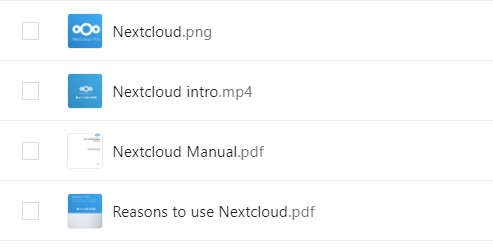

# Install on Ubuntu 20.04 + nginx 7.4-fpm + php7.4 + mariadb

## Before you begin

I definitely disagree with upgrade method for the next version of nextcloud, especially for the version 20 from earlier. It is totally disaster. I've spent too many hours to make it work properly but failed especially for the preview generator. You'd better choose clean install and copy data from old one with rsync or attach data disk if you'd already have separated disk for data.

Hope this guide helps someone who got the headache or who want to avoid the problem while installing Nextcloud.

## Step 1 - Install nginx php mariadb

```bash
apt upgrade && apt update
apt list --upgradable
apt upgrade
reboot
apt update

sudo apt install nginx -y
systemctl start nginx
systemctl enable nginx
systemctl status nginx

apt install php-fpm php-curl php-cli php-mysql php-gd php-common php-xml php-json php-intl php-pear php-imagick php-dev php-common php-mbstring php-zip php-soap php-bz2 -y

sudo apt install mariadb-server -y
```

Edit both php.ini files

```bash
cd /etc/php/7.4/
vim fpm/php.ini
vim cli/php.ini
```

Uncomment and set it like below

```bash
date.timezone = Asia/Seoul
cgi.fix_pathinfo=0
memory_limit = 1024M
```

Edit www.conf

```bash
vim fpm/pool.d/www.conf
```

Uncomment like below

```bash
env[HOSTNAME] = $HOSTNAME
env[PATH] = /usr/local/bin:/usr/bin:/bin
env[TMP] = /tmp
env[TMPDIR] = /tmp
env[TEMP] = /tmp
```

restart php and check status

```bash
systemctl restart php7.4-fpm
systemctl enable php7.4-fpm

ss -xa | grep php
systemctl status php7.4-fpm
```

## Step 2 - Setting Up MariaDB

MariaDB service enable

```bash
systemctl start mariadb
systemctl enable mariadb

systemctl status mariadb
```

Set MariaDB root password

```bash
mysql_secure_installation

Enter current password for root (enter for none): Press Enter
Set root password? [Y/n] Y
Remove anonymous users? [Y/n] Y
Disallow root login remotely? [Y/n] Y
Remove test database and access to it? [Y/n] Y
Reload privilege tables now? [Y/n] Y
```

Create database

```bash
mysql -u root -p
```

Do NOT use the SAME password. You make your own with complexity.

```bash
create database nextcloud_db;
create user nextclouduser@localhost identified by 'Nextclouduser421@';
grant all privileges on nextcloud_db.* to nextclouduser@localhost identified by 'Nextclouduser421@';
flush privileges;
exit
```

## Step 3 - Set SSL certificate with Letsencrypt

Before you begin, you should make sure your server is allowed inbound 80,443. 

```bash
sudo apt install certbot -y
systemctl stop nginx
certbot certonly --standalone -d cloud.towhereim.com
```

## Step 4 - Download NextCloud

```bash
sudo apt install wget unzip zip -y
cd /var/www/
wget -q https://download.nextcloud.com/server/releases/latest.zip

unzip -qq latest.zip
sudo chown -R www-data:www-data /var/www/nextcloud
```

## Step 5 - Configure Nginx Virtual Host for Nextcloud

```bash
cd /etc/nginx/sites-available/
vim nextcloud
```

Modify and Insert below

```bash
upstream php-handler {
    #server 127.0.0.1:9000;
    server unix:/var/run/php/php7.4-fpm.sock;
}

server {
    listen 80;
    listen [::]:80;
    server_name cloud.towhereim.com;
    # enforce https
    return 301 https://$server_name:443$request_uri;
}

server {
    listen 443 ssl http2;
    listen [::]:443 ssl http2;
    server_name cloud.towhereim.com;

    # Use Mozilla's guidelines for SSL/TLS settings
    # https://mozilla.github.io/server-side-tls/ssl-config-generator/
    # NOTE: some settings below might be redundant
    ssl_certificate /etc/letsencrypt/live/cloud.towhereim.com/fullchain.pem;
    ssl_certificate_key /etc/letsencrypt/live/cloud.towhereim.com/privkey.pem;

    # Add headers to serve security related headers
    # Before enabling Strict-Transport-Security headers please read into this
    # topic first.
    #add_header Strict-Transport-Security "max-age=15768000; includeSubDomains; preload;" always;
    #
    # WARNING: Only add the preload option once you read about
    # the consequences in https://hstspreload.org/. This option
    # will add the domain to a hardcoded list that is shipped
    # in all major browsers and getting removed from this list
    # could take several months.
    add_header Referrer-Policy "no-referrer" always;
    add_header X-Content-Type-Options "nosniff" always;
    add_header X-Download-Options "noopen" always;
    add_header X-Frame-Options "SAMEORIGIN" always;
    add_header X-Permitted-Cross-Domain-Policies "none" always;
    add_header X-Robots-Tag "none" always;
    add_header X-XSS-Protection "1; mode=block" always;

    # Remove X-Powered-By, which is an information leak
    fastcgi_hide_header X-Powered-By;

    # Path to the root of your installation
    root /var/www/nextcloud;

    location = /robots.txt {
        allow all;
        log_not_found off;
        access_log off;
    }

    # The following 2 rules are only needed for the user_webfinger app.
    # Uncomment it if you're planning to use this app.
    #rewrite ^/.well-known/host-meta /public.php?service=host-meta last;
    #rewrite ^/.well-known/host-meta.json /public.php?service=host-meta-json last;

    # The following rule is only needed for the Social app.
    # Uncomment it if you're planning to use this app.
    #rewrite ^/.well-known/webfinger /public.php?service=webfinger last;

    location = /.well-known/carddav {
      return 301 $scheme://$host:$server_port/remote.php/dav;
    }
    location = /.well-known/caldav {
      return 301 $scheme://$host:$server_port/remote.php/dav;
    }

    # set max upload size
    client_max_body_size 512M;
    fastcgi_buffers 64 4K;

    # Enable gzip but do not remove ETag headers
    gzip on;
    gzip_vary on;
    gzip_comp_level 4;
    gzip_min_length 256;
    gzip_proxied expired no-cache no-store private no_last_modified no_etag auth;
    gzip_types application/atom+xml application/javascript application/json application/ld+json application/manifest+json application/rss+xml application/vnd.geo+json application/vnd.ms-fontobject application/x-font-ttf application/x-web-app-manifest+json application/xhtml+xml application/xml font/opentype image/bmp image/svg+xml image/x-icon text/cache-manifest text/css text/plain text/vcard text/vnd.rim.location.xloc text/vtt text/x-component text/x-cross-domain-policy;

    # Uncomment if your server is build with the ngx_pagespeed module
    # This module is currently not supported.
    #pagespeed off;

    location / {
        rewrite ^ /index.php;
    }

    location ~ ^\/(?:build|tests|config|lib|3rdparty|templates|data)\/ {
        deny all;
    }
    location ~ ^\/(?:\.|autotest|occ|issue|indie|db_|console) {
        deny all;
    }

    location ~ ^\/(?:index|remote|public|cron|core\/ajax\/update|status|ocs\/v[12]|updater\/.+|oc[ms]-provider\/.+)\.php(?:$|\/) {
        fastcgi_split_path_info ^(.+?\.php)(\/.*|)$;
        set $path_info $fastcgi_path_info;
        try_files $fastcgi_script_name =404;
        include fastcgi_params;
        fastcgi_param SCRIPT_FILENAME $document_root$fastcgi_script_name;
        fastcgi_param PATH_INFO $path_info;
        fastcgi_param HTTPS on;
        # Avoid sending the security headers twice
        fastcgi_param modHeadersAvailable true;
        # Enable pretty urls
        fastcgi_param front_controller_active true;
        fastcgi_pass php-handler;
        fastcgi_intercept_errors on;
        fastcgi_request_buffering off;
    }

    location ~ ^\/(?:updater|oc[ms]-provider)(?:$|\/) {
        try_files $uri/ =404;
        index index.php;
    }

    # Adding the cache control header for js, css and map files
    # Make sure it is BELOW the PHP block
    location ~ \.(?:css|js|woff2?|svg|gif|map)$ {
        try_files $uri /index.php$request_uri;
        add_header Cache-Control "public, max-age=15778463";
        # Add headers to serve security related headers (It is intended to
        # have those duplicated to the ones above)
        # Before enabling Strict-Transport-Security headers please read into
        # this topic first.
        #add_header Strict-Transport-Security "max-age=15768000; includeSubDomains; preload;" always;
        #
        # WARNING: Only add the preload option once you read about
        # the consequences in https://hstspreload.org/. This option
        # will add the domain to a hardcoded list that is shipped
        # in all major browsers and getting removed from this list
        # could take several months.
        add_header Referrer-Policy "no-referrer" always;
        add_header X-Content-Type-Options "nosniff" always;
        add_header X-Download-Options "noopen" always;
        add_header X-Frame-Options "SAMEORIGIN" always;
        add_header X-Permitted-Cross-Domain-Policies "none" always;
        add_header X-Robots-Tag "none" always;
        add_header X-XSS-Protection "1; mode=block" always;

        # Optional: Don't log access to assets
        access_log off;
    }

    location ~ \.(?:png|html|ttf|ico|jpg|jpeg|bcmap)$ {
        try_files $uri /index.php$request_uri;
        # Optional: Don't log access to other assets
        access_log off;
    }
}
```

Make soft link

```bash
ln -s /etc/nginx/sites-available/nextcloud /etc/nginx/sites-enabled/
nginx -t
```

Restart nginx, php

```bash
systemctl restart nginx
systemctl restart php7.4-fpm
```

Open browser, type your domain and set it up 

## Step 6. MP4, Office file Preview Generator

Install and enable PreviewGenerator App on your NextCloud Website

Install LibreOffice ffmpeg ImageMagick GhostScript

```bash
apt install libreoffice libreoffice-l10n-de libreoffice-help-de -y
apt install ffmpeg imagemagick ghostscript -y
```

Append to nextcloud config.php

```bash
vim /var/www/nextcloud/config/config.php
```

append right before the last line

```bash
  'preview_libreoffice_path' => '/usr/bin/libreoffice',
  'enable_previews' => true,
  'enabledPreviewProviders' =>
   array (
      0 => 'OC\\Preview\\TXT',
      1 => 'OC\\Preview\\MarkDown',
      2 => 'OC\\Preview\\OpenDocument',
      3 => 'OC\\Preview\\PDF',
      4 => 'OC\\Preview\\MSOffice2003',
      5 => 'OC\\Preview\\MSOfficeDoc',
      6 => 'OC\\Preview\\PDF',
      7 => 'OC\\Preview\\Image',
      8 => 'OC\\Preview\\Photoshop',
      9 => 'OC\\Preview\\TIFF',
     10 => 'OC\\Preview\\SVG',
     11 => 'OC\\Preview\\Font',
     12 => 'OC\\Preview\\MP3',
     13 => 'OC\\Preview\\Movie',
     14 => 'OC\\Preview\\MKV',
     15 => 'OC\\Preview\\MP4',
     16 => 'OC\\Preview\\AVI',
   ),
```

Modify ImageMagick policy

```bash
vi /etc/ImageMagick-6/policy.xml
```

modify the last lines with below

```xml
  <policy domain="coder" rights="read/write" pattern="PS" />
  <policy domain="coder" rights="read/write" pattern="PS2" />
  <policy domain="coder" rights="read/write" pattern="PS3" />
  <policy domain="coder" rights="read/write" pattern="EPS" />
  <policy domain="coder" rights="read/write" pattern="PDF" />
  <policy domain="coder" rights="read/write" pattern="XPS" />
```

To prevent error like .cache/dconf permission denied, you should make .cache folder

 

```jsx
cd /var/www
mkdir .cache
chown www-data:www-data .cache
```

restart services

```bash
service nginx restart && service php7.4-fpm restart
```

Go to your Nextcloud web site and check if File Tab > mp4 and pdf files` thumbnails are shown like below.



First Run

```bash
sudo -u www-data php /var/www/nextcloud/occ preview:generate-all -vvv
```

Add to Crontab

```bash
crontab -u www-data -e
```

add below at the bottom

```bash
*/10 * * * * php /var/www/nextcloud/occ preview:pre-generate -vvv
```

## Step 7. Tunning

### Security : Strict-Transport-Security

```bash
vim /etc/nginx/sites-available/nextcloud
```

uncomment below (there are two lines to uncomment)

```bash
add_header Strict-Transport-Security "max-age=15768000; includeSubdomains; preload";
```

Database index

```bash
sudo -u www-data php /var/www/nextcloud/occ db:add-missing-indices
```

Install php module

```bash
apt install php7.4-bcmath php7.4-gmp
```

### Redis Cache

```bash
apt install php-apcu redis-server php-redis -y
vim /etc/redis/redis.conf
```

uncomment below

```bash
unixsocket /var/run/redis/redis.sock
unixsocketperm 770
```

add user www-data to redis group

```bash
usermod -aG redis www-data
```

edit nextcloud config

```bash
vim /var/www/nextcloud/config/config.php
```

append the following before the last line

```bash
  'memcache.local' => '\\OC\\Memcache\\Redis',
  'memcache.distributed' => '\\OC\Memcache\\Redis',
  'memcache.locking' => '\\OC\\Memcache\\Redis',
  'redis' =>
   array (
     'host' => 'localhost',
     'port' => 6379,
     'timeout' => 1.5,
     'password' => '',
     'dbindex' => 0,
   ),
```

restart

```bash
systemctl enable redis-server
service nginx restart && service redis-server start
```

## Step 8 - data disk attach and use it as data folder

In my case, my nextcloud is located in Azure, so I just read the doc about how to mount to the linux and I attach and mount the disk which I used it with earlier version of nextcloud.

If you have other nextcloud users, you should make users on the nextcloud users page before try. 

```bash
lsblk -o NAME,HCTL,SIZE,MOUNTPOINT | grep -i "sd"
mkdir /datadisk
sudo mount /dev/sdb1 /datadisk
```

persist volume mount by copying uuid of datadisk

```jsx
ll /dev/disk/by-uuid
vim /etc/fstab
```

fill the end of line like below

```jsx
UUID=2ab10ce3-0ebb-49c6-92cb-0f6efdb83668 /datadisk ext4 defaults 0 0
```

and I wanted to use it as a symlink but It doesn't support as the forum say. 

```bash
service nginx stop && service redis-server stop
vim /var/www/nextcloud/config/config.php
```

change datadirectory to /datadisk/data and save file.

```bash
'datadirectory' => '/datadisk/data',
```

cleansing the old data folder and copy some folder from newly installed data folder

```bash
cd /datadisk/data
rm -rf appdata_ocia72rbpqse/
rm nextcloud.log

cd /var/www/nextcloud/data/
cp -pr nextcloud.log /datadisk/data/
cp -pr appdata_oclcbm53xjmv/ /datadisk/data/
cp -pr files_external/ /datadisk/data/

service nginx start && service redis-server start
```

filesan and generate preview

```bash
sudo -u www-data php /var/www/nextcloud/occ files:scan --path /{username}/
sudo -u www-data php /var/www/nextcloud/occ preview:generate-all -v
```

### Preview Generator - run if preview generation time is too slow

```bash
cd /var/www/nextcloud
chmod +x ./occ
sudo -u www-data php occ config:app:set previewgenerator squareSizes --value="32 256"
sudo -u www-data php occ config:app:set previewgenerator widthSizes  --value="256 384"
sudo -u www-data php occ config:app:set previewgenerator heightSizes --value="256"
sudo -u www-data php occ config:system:set preview_max_x --value 2048
sudo -u www-data php occ config:system:set preview_max_y --value 2048
sudo -u www-data php occ config:system:set jpeg_quality --value 60
sudo -u www-data php occ config:app:set preview jpeg_quality --value="60"
```

Reference

[How to Install Nextcloud with Nginx and Let's Encrypt SSL on Ubuntu 20.04 LTS](https://www.howtoforge.com/tutorial/ubuntu-nginx-nextcloud/)

[Nextcloud: Install Preview Generator](https://www.allerstorfer.at/nextcloud-install-preview-generator/)

[Thumbnail preview generation](https://help.nextcloud.com/t/thumbnail-preview-generation/34123/7)

[Nextcloud & Redis](https://blog.lordvan.com/blog/nextcloud-redis/)

[Add a data disk to Linux VM using the Azure CLI - Azure Virtual Machines](https://docs.microsoft.com/en-us/azure/virtual-machines/linux/add-disk#connect-to-the-linux-vm-to-mount-the-new-disk)